Author: wahyu arif kurniawan

## A. Logika
1. Olahraga bersama: **Kapan A, B, dan C akan berolahraga bersama lagi setelah 17 Agustus?**
   1. Tentukan kelipatan persekutuan terkecil dari 2, 3, dan 5 (KPK dari 2, 3, 5).
      KPK(2, 3, 5) = 30
   2. Tanggal berikutnya setelah 17 Agustus yang merupakan kelipatan persekutuan terkecil adalah 30 Agustus.
      Jadi, A, B, dan C akan berolahraga bersama lagi pada tanggal 30 Agustus.
   3. Namun, karena A berolahraga setiap 2 hari sekali, B setiap 3 hari sekali, dan C setiap 5 hari sekali, kita perlu menemukan kelipatan dari 2, 3, dan 5 yang lebih besar dari 17 Agustus.
   4. Dengan demikian, kita lihat bahwa tanggal berikutnya setelah 17 Agustus yang merupakan kelipatan dari 2, 3, dan 5 adalah 30 Agustus (KPK dari 2, 3, 5).
   5. Jadi, A, B, dan C akan berolahraga bersama lagi pada tanggal 30 Agustus.
2. Umur Kaka beradik: **Berapa umur Budi 5 tahun mendatang jika umur Ayu sekarang = 15 tahun?**
   1. Jika Ayu sekarang berumur 15 tahun, maka Cinta (kakak Ayu) berumur 15 + 5 = 20 tahun. 
   2. Umur Budi saat ini adalah 2 kali umur Cinta, jadi Budi saat ini berumur 2 * 20 = 40 tahun. 
   3. Umur Budi 5 tahun mendatang adalah 40 + 5 = 45 tahun. 
   4. Jadi, umur Budi 5 tahun mendatang adalah 45 tahun.
3. Menyusul Ali: **Berapa lama waktu yang dibutuhkan Budi untuk menyusul Ali?**
   1. Ali bergerak dengan kecepatan 60 km/jam, dan Budi bergerak dengan kecepatan 90 km/jam. 
   2. Perbedaan kecepatan antara Ali dan Budi adalah 90 - 60 = 30 km/jam. 
   3. Budi bergerak 30 menit (0,5 jam) setelah Ali. 
   4. Jarak yang harus dikejar oleh Budi adalah 0,5 jam * 30 km/jam = 15 km. 
   5. Waktu yang dibutuhkan oleh Budi untuk menyusul Ali adalah 15 km / 30 km/jam = 0,5 jam atau 30 menit. 
   6. Jadi, **Budi akan menyusul Ali dalam waktu 30 menit.**
4. Mendapatkan 4L air:  **Bagaimana mendapatkan air sebanyak 4L pada wadah 8L dan 6L tanpa alat ukur?**
   1. Isi wadah 6L hingga penuh. 
   2. Tuangkan air dari wadah 6L ke wadah 8L hingga wadah 8L penuh. 
   3. Pada saat ini, di wadah 6L masih tersisa 2L air (8L - 6L). 
   4. Buang air dari wadah 8L sehingga wadah 8L kosong. 
   5. Tuangkan air dari wadah 6L ke wadah 8L (yang kini kosong) hingga wadah 8L penuh. Sehingga di wadah 6L akan tersisa 2L. 
   6. Isi wadah 6L hingga penuh lagi. 
   7. Tuangkan air dari wadah 6L ke wadah 8L yang sudah berisi 2L air. Sehingga di wadah 8L akan tersisa 4L air. 
   8. Jadi, dengan langkah-langkah tersebut, Kita dapat mendapatkan air sebanyak 4 Liter pada wadah 8 Liter.
## B. SQL
1. Menampilkan daftar Movie dengan stock < 5, diurutkan berdasarkan harga ascending.
    ```sql
    SELECT * FROM movie WHERE stock_dvd < 5 ORDER BY price ASC;
    ```
    
2. Menampilkan nama dan stok film dari tabel 'movie'.
    ```sql
    SELECT name AS "Nama Film", (stock_dvd * price) AS "STOCK VALUE" FROM movie;
    ```
    
3. Menampilkan jumlah film dalam tabel 'MOVIE' dengan karakter 'E' dalam nama.
   ```sql
   SELECT COUNT(*) AS "Jumlah Movie" FROM movie WHERE LOWER(name) LIKE '%e%';
   ```
   
4. Menambahkan movie baru ke dalam tabel dengan mengisi data yang diperlukan.
    ```sql
    INSERT INTO movie (kode, name, stock_dvd, price) VALUES ('mov6', 'Interstellar', 4, 18000);
    ```
    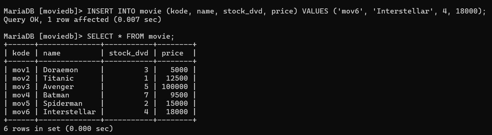
5. customer yang menyewa film "Avenger"
   ```sql
   SELECT customer.customer AS "Nama Customer" FROM moviedb.customer JOIN moviedb.movie ON customer.kode = movie.kode WHERE movie.name = 'Avenger';
   ```
   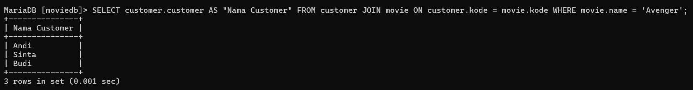
6. Menampilkan nama film dengan penyewa lebih dari 1.
   ```sql
   SELECT movie.name AS "Nama Movie", COUNT(customer.customer) AS "Jumlah Penyewa" FROM movie JOIN customer ON movie.kode = customer.kode GROUP BY movie.name HAVING COUNT(customer.customer) > 1;
   ```
   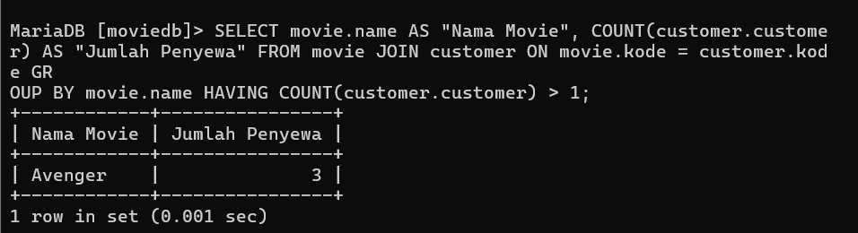
7.  ```sql 
    SELECT MAX(stock_dvd) AS "Max Stock DVD" FROM movie WHERE price > 10000;
    ```
    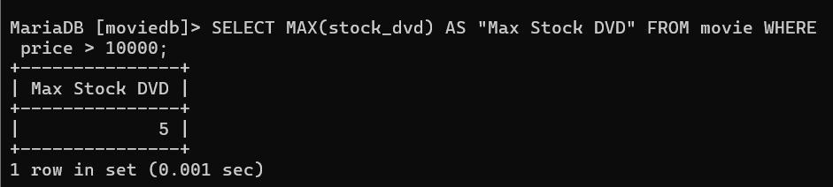
8.  ```sql
    SELECT SUM(price * stock_dvd) AS "Total Price for Stock DVD < 4" FROM movie WHERE stock_dvd < 4;
    ```
    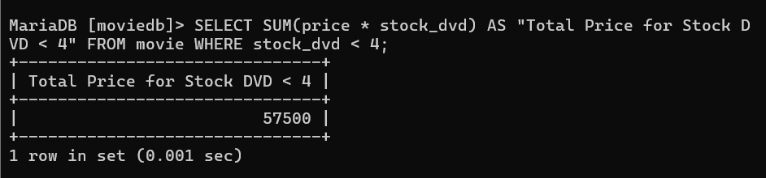
9.  ```sql
    SELECT COUNT(kode) FROM customer;
    ```
    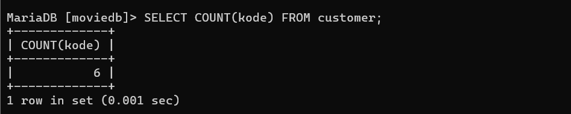
10. ```sql
    SELECT m.name AS "Nama Film", COUNT(c.customer) AS "Jumlah Penyewa"
    FROM Movie m
    INNER JOIN CUSTOMER c ON c.KODE = m.KODE
    WHERE m.PRICE > 15000
    GROUP BY m.name;
    ```
    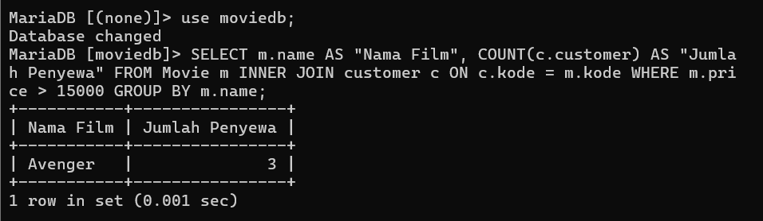
11. ```sql
    SELECT name, COUNT(name) FROM movie m
    inner join customer c ON c.kode = m.kode
    WHERE m.price > 15000
    GROUP BY name;
    ```
    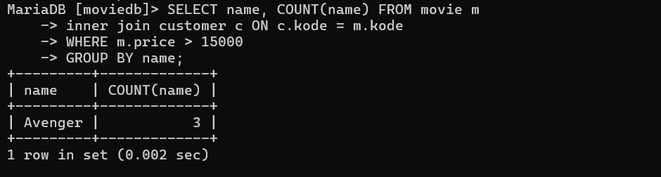

## C. Pemrogramman
1. Data fetch
   ```php
   <?php
      function fetchDataFromDatabase() {
         $servername = "localhost";
         $username = "root";
         $password = "";
         $dbname = "moviedb";
         
         $conn = new mysqli($servername, $username, $password, $dbname);

         if ($conn->connect_error) {
            die("Koneksi gagal: " . $conn->connect_error);
         }

         $sql = "SELECT * FROM movie ORDER BY price ASC LIMIT 3";
         $result = $conn->query($sql);

         if ($result->num_rows > 0) {
            echo "<table>";
            echo "<tr><th>Nama Film</th><th>Stock DVD</th><th>Harga</th></tr>";
            

            while($row = $result->fetch_assoc()) {
                  echo "<tr>";
                  echo "<td>" . $row["name"]. "</td>";
                  echo "<td>" . $row["stock_dvd"]. "</td>";
                  echo "<td>" . $row["price"]. "</td>";
                  echo "</tr>";
            }

            echo "</table>";
         } else {
            echo "Tidak ada data.";
         }

         $conn->close();
      }
      fetchDataFromDatabase();
   ?>

   ```
   Output:
   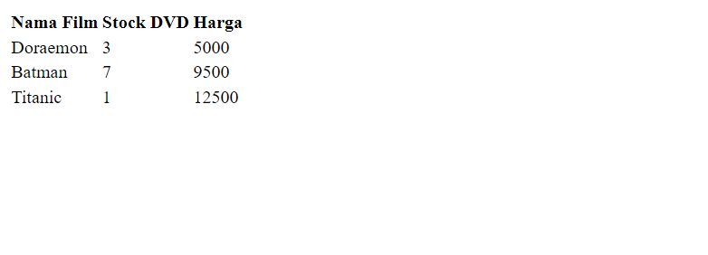

2. Check Prime
   ```html
   <!DOCTYPE html>
   <html lang="en">
   <head>
      <meta charset="UTF-8">
      <meta name="viewport" content="width=device-width, initial-scale=1.0">
      <title>Check Prime</title>
   </head>
   <body>

   <h2>Check Prime Number</h2>

   <form id="primeForm">
      <label for="numberInput">Masukan 9 digit angka:</label>
      <input type="text" id="numberInput" pattern="\d{9}" title="Please enter a 9-digit number" onkeypress="return processOnEnter(event)" required>
      <button type="button" onclick="processNumber()">Check Prime</button>
   </form>

   <div id="result"></div>

   <script>
   function processNumber() {
      var inputElement = document.getElementById('numberInput');
      var resultElement = document.getElementById('result');

      var input = inputElement.value;

      if (input.length === 9 && /^\d+$/.test(input)) {
         
         var digit1 = input[0];
         var digit4 = input[3];
         var digit9 = input[8];
         var digit6 = input[5];

         
         var processedNumber = parseInt(digit1 + digit4 + digit9 + digit6);

         
         var isPrime = true;

         if (processedNumber < 2) {
               isPrime = false;
         } else {
               for (var i = 2; i <= Math.sqrt(processedNumber); i++) {
                  if (processedNumber % i === 0) {
                     isPrime = false;
                     break;
                  }
               }
         }

         
         resultElement.innerHTML = "Bilangan yang diproses = " + processedNumber + "<br>";
         resultElement.innerHTML += isPrime ? "Bilangan tersebut adalah bilangan prima." : "Bilangan tersebut bukan bilangan prima.";
      } else {
         resultElement.innerHTML = "Input harus berupa 9 digit angka.";
      }
   }

   function processOnEnter(event) {
      if (event.key === 'Enter') {
         processNumber();
         return false; 
      }
      return true;
   }
   </script>

   </body>
   </html>
   ```
   Output:
   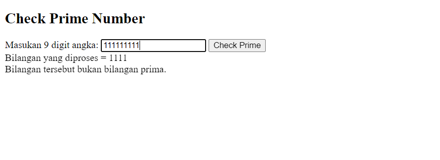

3. Short Number
   ```javascript
   const readline = require('readline');

   const rl = readline.createInterface({
   input: process.stdin,
   output: process.stdout
   });

   rl.question("Masukkan bilangan 5 digit: ", function(userInput) {

      if (userInput.length === 5 && /^\d+$/.test(userInput)) {
         var sortedNumber = userInput.split('').sort(function(a, b) {
               return b - a;
         }).join('');
         console.log("Urutan bilangan dari besar ke kecil: " + sortedNumber);
      } else {
         console.log("Input tidak valid. Harap masukkan bilangan 5 digit.");
      }


      rl.close();
   });

   ```
   Output:
   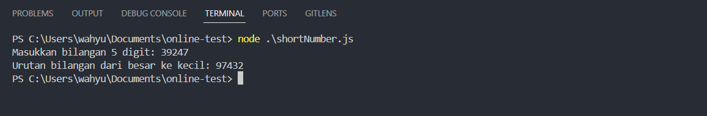
